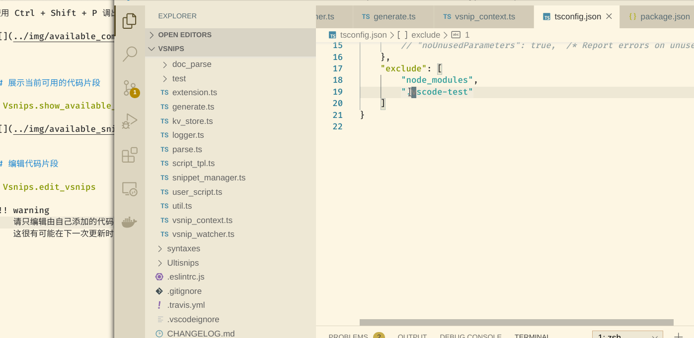

# Available Commands

This section will introduce commands.
Use Ctrl + Shift + P for commands.

## Show Available Snips

> Vsnips.show_available_snippets

## Edit Your Snips

> Vsnips.edit_vsnips

This command will open a new window for editing snips.

!!! warning
    Please do not edit the default snips, because it will change after the Vsnips update.
