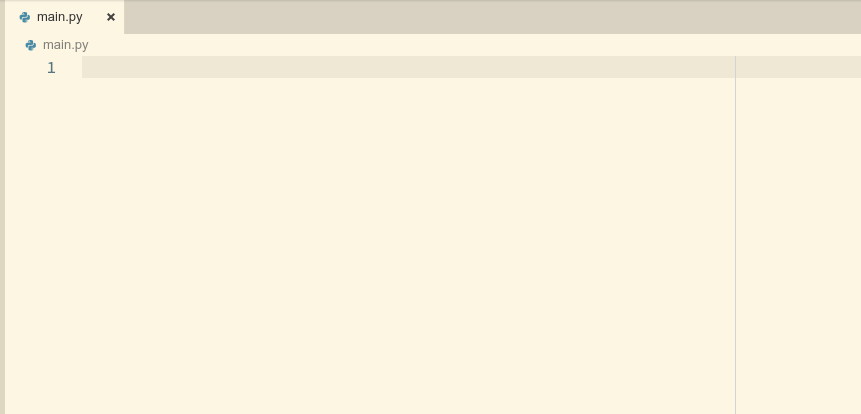

# Vsnips

Allow user use Ultisnips in vscode.

> It is under development, although I can't guarantee that
> all ultisnips functions can be used in vscode, I will do my best.
> Please feel free to give an issue or pull requests.

There are two 

| English Documents | 中文文档 |
| ---- | ---- |
| [introduction](en/intro.md) | [简介](zh/intro.md) |
| [comments](en/comments.md) | [注释功能的使用](zh/comments.md) |
| [example snips](en/example_snips.md) | [示例代码片段](zh/example_snips.md) |
| [available commands](en/available_commands.md) | [Vsnips可用的命令](zh/available_commands.md) |

