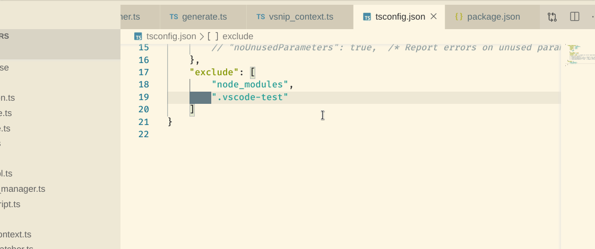
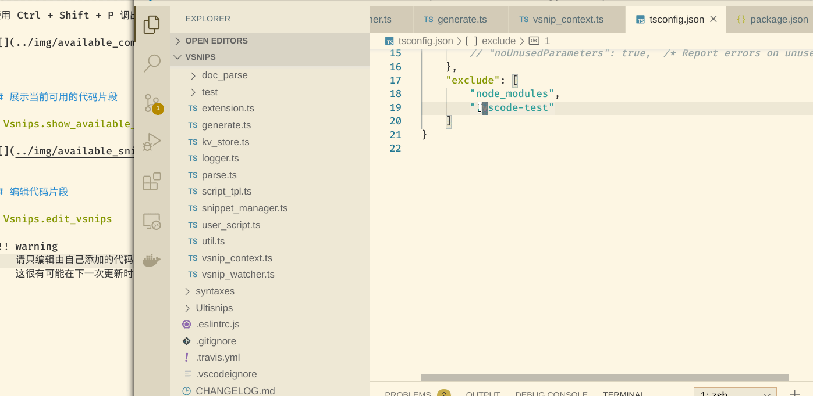

这一部分主要介绍目前可用的 Vsnips 命令.

使用 Ctrl + Shift + P 调出配置

## 展示当前可用的代码片段

> Vsnips.show_available_snippets

## 编辑代码片段

> Vsnips.edit_vsnips

此操作会打开一份新的窗口, 将当前的 UltiSnips 对应的文件夹全部显示.

!!! warning
    请只编辑由自己添加的代码片段, 不要试图去修改由 Vsnips 自带的片段,
    这很有可能在下一次更新时改变
