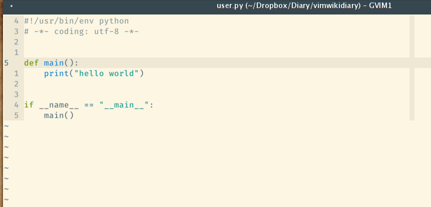

> 程序依然在开发中, 虽然我不能保证所有的UltiSnips片段都可以在vscode中使用,
> 但我会尽最大的努力去兼容 UltiSnips, 并且允许用户自定义一些功能函数.
>
> 有任何想法欢迎开 issue 或是 pull requests.

## UltiSnips

UltiSnips 为 VIM 中的插件, 有关 UltiSnips 的详细简介请看[这里][1].

.

定义 UltiSnipts 格式的代码片段是十分简单的, 以`Python`语言为例, 我平时会经常用到`import IPython; IPython.embed()`,
在 UltiSnips 中, 你可以这样用:

```snippets
# 请注意, 下面的片段必须保存在 python.snippets, 这样才能被 Python 语言使用.
snippet dbg "Use IPython to debug"
# ---------- XXX: Can't GIT add [START] ---------- #
import IPython
IPython.embed(using=False)
# ---------- XXX: Can't GIT add  [END]  ---------- #
endsnippet
```

从上面的实例来看, 一个代码片段以`snippet`开头, 以`endsnippet`结尾,
随后的`dbg`用于触发这个片段, `"Use IPython to debug"`自然就是
这一片段的描述信息了, 在我的的 vim 中, 此片段有如下的效果:

.


## VScode 代码片段管理

在 VScode 中, 有自己原生的代码片段管理方式, 你可以依据 [snippets语法][4] 来编写自己的代码片段. 但它有几个弊端,

1. 以json的形式保存的代码片段对换行支持并不友好, 多行的片段写起来并不方便
2. 多台电脑同步代码片段并不容易, 我发现好多各个语言都有自己的代码片段插件, 比如: [C/C++ Snippets][5], [Bootstrap 3 Snippets][6].

并不是说每种语言有自己的代码片段插件不好, 只是当你想要改动或是增加自己的语言片段时,
极大可能是要完整的学习一遍插件的制作, 以及代码片段的书写. 而且更为重要的一点是,
如果你同时也是 Vim 用户, 你就不得不为两个编辑器各写一套代码片段了, 这样的折磨我受了很久,
于是便有了这个插件.

## Vsnips 基础使用

> 该插件基于 VScode 原生的[代码补全功能][8], 无论你先前是否有过 Vim 或是 UltiSnips 的使用经历,
> 都可直接使用此插件. 我已经将部分的 UltiSnips 进行了适配, 并且默认给所有用户使用.

当然如果你先前已经使用过了 UltiSnips, 有了自己的代码片段,
那么你可以直接在配置中添加自己的片段文件目录, 并且你可以引用在 vimrc 中定义的变量.

```json
{
    "Vsnips.VarFiles": [
        "/home/corvo/.vimrc",
        "/home/corvo/.vim/common.vim",
    ],
    "Vsnips.SnipsDir": [
        "/home/corvo/.vim/UltiSnips"
    ]
}
```

当你在 vimrc 中给出了如下变量`let g:snips_author="corvo"`, 在代码片段中, 可以使用如下的形式引用,
无论是在 Vim 还是在 VScode 中均可正常使用.

```snippets
snippet full_title "Python title fully"
#!/usr/bin/env python
# -*- coding: utf-8 -*-
# vim: ts=4 sw=4 tw=99 et:

"""
@Date   : `!v strftime("%B %d, %Y")`
@Author : `!v g:snips_author`

"""

endsnippet
```

## 已经完善的功能

* [x] 安装后即有多种语言补全的支持
* [x] 允许用户添加自己的 UltiSnips 片段
  * [x] 从 UltiSnips 格式到 VScode 格式的转换
  * [x] Vim 中 strftime 函数支持
  * [x] 允许用户自定义变量
  * [x] 少量的 Python 函数支持(使用 Javascript 重写)
* [x] snippets 语法高亮
* [x] 对于用户自定义 JavaScript 函数的支持
* [x] 支持`autoDocstring`的功能, 允许为函数增加注释, 当前已经支持(Python, TypeScript, Golang)
* [x] box 功能的支持


## 正在开发的功能

* [ ] 支持`extends`与`priority`语句
* [ ] 用户用户选取 box 片段后再次进行编辑

[1]: https://github.com/SirVer/ultisnips
[3]: https://user-images.githubusercontent.com/12025071/62412148-14cad280-b631-11e9-8d9c-01a65a2550ef.gif
[4]: https://code.visualstudio.com/docs/editor/userdefinedsnippets#_creating-your-own-snippets
[5]: https://marketplace.visualstudio.com/items?itemName=hars.CppSnippets
[6]: https://marketplace.visualstudio.com/items?itemName=wcwhitehead.bootstrap-3-snippets
[7]: https://user-images.githubusercontent.com/12025071/62412552-19928500-b637-11e9-8335-dfe3f0ca0688.gif
[8]: https://code.visualstudio.com/api/references/vscode-api#CompletionItemProvider
[9]: https://marketplace.visualstudio.com/items?itemName=njpwerner.autodocstring